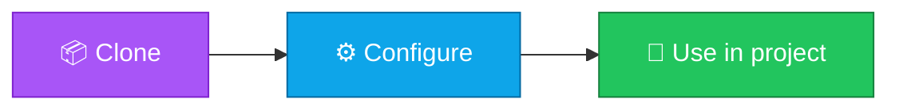

<p align="center">
  
</p>

<h1 align="center">react-vite-starter</h1>

<p align="center">
  <strong>EN</strong> Folder scaffold and docs for a Vite + React + TypeScript app. This is a layout/docs starter — generate a full app with `npm create vite@latest` when ready.<br/>
  <strong>PT</strong> Scaffold de pastas e documentação para uma app Vite + React + TypeScript. É um starter de layout/docs — gera a app completa com `npm create vite@latest` quando estiveres pronto.
</p>

<p align="center">
  <a href="https://github.com/manansbdb/react-vite-starter/blob/main/LICENSE"></a>
  
  
  <a href="#support--apoio"></a>
</p>

---

## What it does / Para que serve

| English | Português |
|---------|-----------|
| Folder scaffold and docs for a Vite + React + TypeScript app. This is a layout/docs starter — generate a full app with `npm create vite@latest` when ready. | Scaffold de pastas e documentação para uma app Vite + React + TypeScript. É um starter de layout/docs — gera a app completa com `npm create vite@latest` quando estiveres pronto. |



---

## Install / Instalação

### 1) Clone

```bash
git clone https://github.com/manansbdb/react-vite-starter.git
cd react-vite-starter
```

### Use / Usar

```bash
src/
  main.tsx
  App.tsx
  components/
  hooks/
  styles/
public/
index.html
tsconfig.json
vite.config.ts
```

### Requirements / Requisitos

- `git`
- No paid services required / Sem serviços pagos

---

## Recommended layout / Layout recomendado

```
src/
  main.tsx
  App.tsx
  components/
  hooks/
  styles/
public/
index.html
tsconfig.json
vite.config.ts
```

## Quick create / Criação rápida

```bash
npm create vite@latest my-app -- --template react-ts
cd my-app && npm install && npm run dev
```

See `docs/STRUCTURE.md` for bilingual folder conventions.

---

## Support / Apoio

Bitcoin donations welcome / Doações em Bitcoin bem-vindas:

```
bc1q0qfnlnxyum9u45stzxe0a7jnhtj4j0usfkqdjw
```

**Network / Rede:** BTC (Bech32).

---

## License / Licença

[MIT](./LICENSE) © 2026 manansbdb
